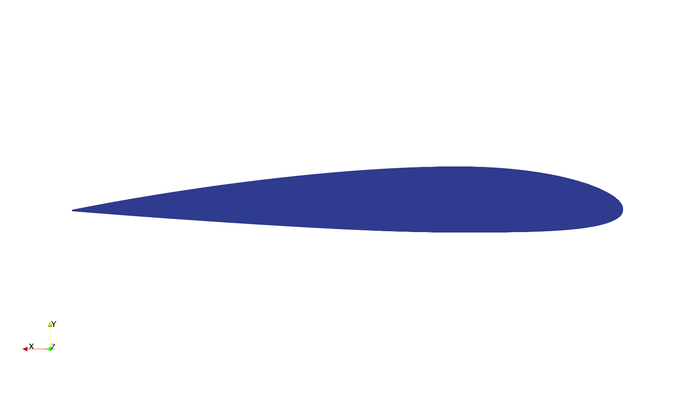

# Community course on preCICE: FSI Workflow

Introductory course at the preCICE Workshop 2024, Stuttgart, September 24-27, 2024

\vspace{2em}

Claudio Caccia, Politecnico di Milano\newline `<claudiogiovanni.caccia@polimi.it>`

Gerasimos Chourdakis, University of Stuttgart\newline `<gerasimos.chourdakis@ipvs.uni-stuttgart.de>`

This is a community-contributed part of the course: [Contribute on GitHub](https://github.com/precice/community-training).

## Dependencies

We will use the following software:

- [FreeCAD](https://www.freecad.org/) (at least version 0.21)
- [preCICE](https://precice.org/installation-overview.html) (at least version 3.1)
- [CalculiX](http://calculix.de/) (tested with v2.20) and the [CalculiX adapter](https://precice.org/adapter-calculix-overview.html)
- [OpenFOAM](https://www.openfoam.com/) (tested with v2406) and the [OpenFOAM adapter](https://precice.org/adapter-openfoam-overview.html)

## Task 0: Prepare the geometry

{#fig:t0-geometry width=7cm}

We will simulate fluid-structure interaction of a very simple airfoil, in 3D. [NACA airfoils](https://en.wikipedia.org/wiki/NACA_airfoil) are standardized designs that are popular in designing aircraft wings.
Our case is slightly derived from the following paper:

*S. Heathcote, Z. Wang, I. Gursul, **Effect of spanwise flexibility on flapping wing propulsion**, Journal of Fluids and Structures, Volume 24, Issue 2, 2008*.

In the paper, they considered a *NACA0012* profile, while our training involves a **NACA2312** profile wing (to have some lift at 0° angle of attack) with:

- *chord* $c=100mm$
- *span* $b=300mm$

We would typically start by designing our geometry in a CAD software (e.g., FreeCAD), but we assume you already know how to do that using your own workflows. To save some time, use the wing model that you can find in this folder.

We have generated the geometry using the software [Salome](https://www.salome-platform.org/) and exported it to our needs.

You'll notice that two different file formats are provided: a `.stl` file and a `.step` file. Both are widely used for data exchange and nearly all CAD systems allow importing and exporting such formats. In this training, we will need both files: See why in the notes below.

When meshing a flow domain, we need to consider whether we are simulating external or internal flow. In this case, we are considering an external flow: we will use the solid geometry to generate the **solid mesh**, and we will subtract it from a sufficiently large box to generate the **fluid mesh**.

### Notes on file formats

You might wonder: "Why two formats?".

We will prepare the fluid mesh using the `snappyHexMesh` tool of OpenFOAM. This [supports various geometry formats](https://www.openfoam.com/documentation/guides/latest/doc/guide-meshing-snappyhexmesh-geometry.html), including [STL](https://en.wikipedia.org/wiki/STL_(file_format)), a quite common format.

STL files describe unstructured triangulated surfaces. However, some tools cannot model solids based on this description. Instead, we will use a [STEP](https://en.wikipedia.org/wiki/ISO_10303-21) file to describe the solid, which explicitly defines volumes.

Once you generate your model with your favorite CAD tool, you can export it in both formats and use these the way we'll use them in the following tasks.

Notice that, sometimes, some parameters need to be tuned in order to obtain a sufficiently refined STL surface. Use the provided files to avoid any mesh-related issues later on. Overall, meshing is often (very) complicated, and we only want to give you a starting point for a rather simple case.
