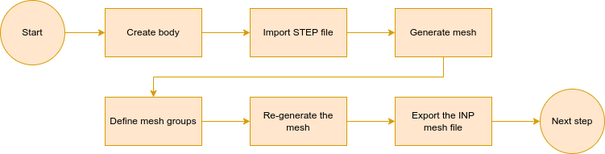
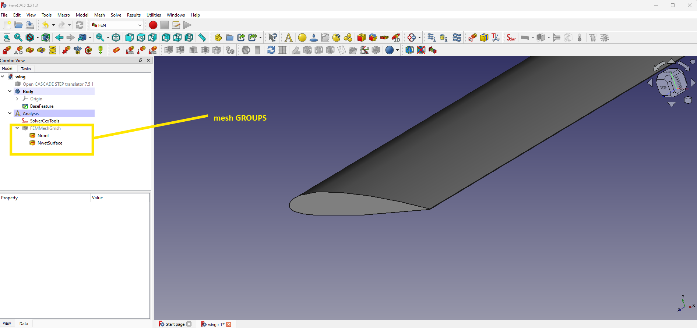

# Task 1: Mesh of Solid domain

In this section we'll generate a CalculiX mesh for the solid, using the [FEM Workbench of FreeCAD](https://wiki.freecad.org/FEM_Workbench). We will only use it to generate the mesh, and we will start the simulation from the terminal later on. See the general overview of this task in Figure @fig:t1-overview.

{#fig:t1-overview}

## Adjust the FreeCAD settings

### Export settings

Before you start, change the settings of the INP exporter to export groups together with the mesh.

Select the `FEM Workbench` (Figure @fig:t1-workbench).

{#fig:t1-workbench}

\newpage

Go to:

- Click `Edit` -> `Preferences...`.
- Select the `Import-Export` icon on the left.
- Select the `INP` tab.

Configure as follows:

- Which elements to export: `FEM`.
- Export group data: (check).

Then, click `Apply` and `OK`.

## Import the wing

The first task consists in importing the wing (Figure @fig:t1-rename):

- Create a new project: Click `File` -> `New`.
- Give the model a name: In the `Combo View/Model` tab on the left, select the unnamed model and change the `Label`: click on the `Unnamed` and rename it to `Wing`.

{#fig:t1-rename}

- Select the `Part design` workbench from the drop-down menu and click `create body` (Figure @fig:t1-new-body).

{#fig:t1-new-body}

- In the `Model` tab, you can now see a new body as part of the `Wing` model (Figure @fig:t1-new-body-2).

{#fig:t1-new-body-2}

- Click `File` -> `Import...`.
- Select the STEP file `naca2312.step`.
- In newer FreeCAD versions, a pop-up dialog will be shown. Click `OK` with the defaults (Figure @fig:t1-import).

{#fig:t1-import}

An object named `Open CASCADE STEP Translator 7.5 1` should appear on the left, a wing-shaped object should appear rendered. Drag and drop this object into `Body`. This should appear as a `BaseFeature` entry under the `Body` (Figure @fig:t1-base-feature).

{#fig:t1-base-feature}

## Generate the mesh

Now we can generate a mesh for the `Wing`.

- Switch again to the FEM Workbench from the drop-down menu.
- From the menu bar, click `Model` -> `Analysis container` (or select the `A` symbol from the toolbar, Figure @fig:t1-fem-container).

{#fig:t1-fem-container}

- We want to mesh the `BaseFeature`: Select it from the sidebar.
- From the menu bar, click `Mesh` -> `FEM Mesh from shape by GMSH` (Figure @fig:t1-mesh01). The FEM Workbench can generate meshes using different backends; we use [GMSH](https://gmsh.info/) here.

{#fig:t1-mesh01}

- In the `Tasks` tab, use the following parameters (Figure @fig:t1-mesh02):
  - Element dimension: `3D`
  - Element order: `2nd`
  - Max element size: `20mm`
  - Min element size: `10mm`

{#fig:t1-mesh02}

- Click `Apply` and `OK` to generate the mesh.

If everything went as expected, a mesh should appear (Figure @fig:t1-mesh03). Otherwise:

- In case you get any error related to creating temporary files, see the troubleshooting section below.
- In case you get a `File to load not existing or not readable` error, try again after a couple of seconds.

{#fig:t1-mesh03}

## Create mesh groups

Now that we have a mesh, we also need to create the boundaries. We will need to identify the `root surface`, which will be clamped, and the `wet surface`, which will be in contact with the fluid. These surfaces are defined as [mesh groups](https://wiki.freecad.org/FEM_MeshGroup).

- From the `Model` tab, expand the `Analysis` branch and select `FEMMeshGmsh` (Figure @fig:t1-groups01).

{#fig:t1-groups01}

- Change the property `Groups of Nodes` to `true` (Figure @fig:t1-groups01-detail).

{#fig:t1-groups01-detail width=7cm}

- Click `Mesh` -> `FEM Mesh group` (Figure @fig:t1-groups02).

{#fig:t1-groups02}

- In the `Model` tab, there should now also be a `MeshGroup` under the `FEMMeshGmsh` (Figure @fig:t1-groups03).

{#fig:t1-groups03}

- In the `Tasks` tab, select `Label` as `Identifier used for mesh export` and `Face, Edge, Vertex` as `Selection mode` (Figure @fig:t1-groups04).

{#fig:t1-groups04}

- Click `Add`, then click on the rendering to select the profile of the wing (pay attention to reference frame to identify it), and `OK` to add the surface to the mesh group (Figure @fig:t1-root_group). You can rotate the view using the cube in the upper right corner, or [using your mouse](https://wiki.freecad.org/Mouse_navigation) (e.g., by `Shift` + `right click`).

{#fig:t1-root_group}

- In the `Model` tab, select the `MeshGroup` and rename its `Label` to `Nroot` (Figure @fig:t1-groups-05). This will help us define the boundary condition in the Solid domain.

  **NOTE**: Node group names need to start with `N`.

{#fig:t1-groups-05}

- Select again the mesh (`FEMMeshGmsh`) and define a new group comprising all components of the `wetSurface` (they are 4: as shown below. Pay attention to the trailing edge surface, you need to zoom-in to see it). See Figures @fig:t1-ws-steps and @fig:t1-ws-group.
  1. Click `Add`
  2. `select` a patch
  3. `repeat` steps `1.` and `2.` for each of the four elements
  4. Click `OK`

{#fig:t1-ws-steps}

{#fig:t1-ws-group}
  
- Like for the `root` group, change the `Label` in the `Properties` to `NwetSurface` (Figure @fig:t1-ws-rename).

{#fig:t1-ws-rename}

You should now see a list of two groups under the current mesh (Figure @fig:t1-groups-final).

{#fig:t1-groups-final}

**IMPORTANT**: You now need to re-mesh to generate the groups. Select the mesh (`FEMMeshGmsh`) -> double click -> click `Apply` to re-mesh and create groups -> click `OK`.

## Export the mesh file and verify

We are now ready to export the mesh into a `.inp` file (Abaqus input file format, compatible with CalculiX):

- Keep the mesh (`FEMMeshGmsh`) selected.
- Click `File` and `Export...`.
- Name the file `wing2312.inp` and place it in the `01_solidMesh` directory.
- Select `FEM mesh formats (*.dat, *.inp, ...)` and click `Save`.

Save also the FreeCAD project with `File` and `Save`.

To verify, open the `wing2312.inp` file you just generated with a text editor:

- Look for `NSET`: you should find
  - `NSET=Nall`: this keyword defines the beginning of the list of coordinates of all the mesh nodes
  - `*NSET, NSET=Nroot_Nodes`: this keyword defines the beginning of the list of node IDs belonging to the mesh group `Nroot`
  - `*NSET, NSET=NwetSurface_Nodes`: this keyword defines the beginning of the list of node IDs belonging to the mesh group `NwetSurface`
- Take note of the exact names of all the sets of nodes for each of the groups, because we'll use them in the following steps.
- `*ELSET, ELSET=GROUPNAME_Faces`: where `GROUPNAME` is one of the groups that you defined (`Nroot`, `NwetSurface`). These sets define the groups of surface elements. We don't need them for the FSI simulation

## Scale the mesh file

Unfortunately, FreeCAD exports all node coordinates in millimeters and, at least in version 0.21, there is no option to change it. We prefer to have everything in SI units so, in the `01_solidMesh` folder you can find a `inp_convert.py` file. After checking that the name on line 43 matches your mesh file, run it:

`python3 inp_convert.py`

You should find a `wing2312_m.inp` file in your folder.

## Troubleshooting

### File permission issues

Check this section if you face any file permission issues while running GMSH.

Depending on the installation method (e.g., when using an AppImage file on Linux), some tools (e.g., GMSH) might not be able to write some necessary temporary files in the default directories. You can change this working directory:

- Click `Edit` -> `Preferences`.
- Select the `FEM` icon from on the left.
- In the `General` tab, switch from `Temporary directories` to `Use custom directory`.
- Select a path where you know your user can write files (e.g., your `Desktop`).

### Options unavailable

In case you cannot select anything, and you get an error "Active Task Dialog found!", you might need to switch to the `Tasks` tab and click `OK` or `Cancel` to exit from the previous task.

Several options only appear if you have selected an object they can be applied on, and every workbench comes with completely different buttons and options.
