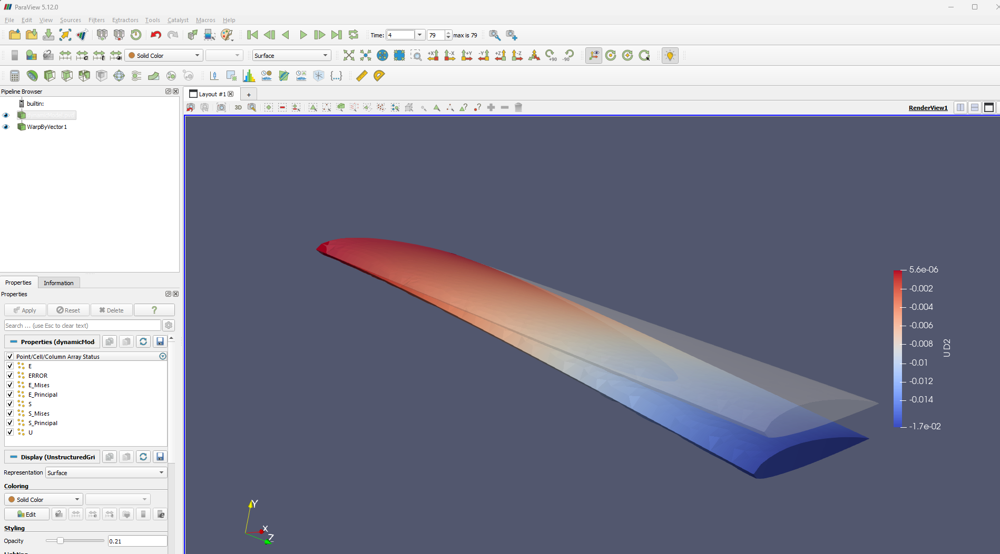

# Task 2: simulation of the Solid domain

In this section we'll simulate the *Solid Domain* alone, to gain confidence with the **CalculiX** syntax and to check that our solid mesh and model work.

## Dynamic Simulation

This model allows you to perform a dynamic simulation in which the cantilevered wing is subjet to its own weight. The load is applied progressively, with a ramp law (yes, we know that it is not very realistic... But we just want to have a look at a simple CalculiX simulation).

### Complete the staticModel.inp file

Enter the `dynamic` folder and:

- Copy your generated solid mesh in the current folder

Open the `dynamicModel.inp` file and:

- replace **YOURMESH.inp** (line **4**) with the name of your mesh (`wing2312_m.inp`)
  - Note that CalculiX expects distance units in meters, while FreeCAD generates meshes with distances in millimeters. We need to adapt the values.
- replace **E**, **NU**, **RHO** (i.e. the material properties of the material, lines **10, 12**) with the following:
  - `2000000` ($E=200 MPa$)
  - `0.3` ($\nu = 0.3$)
  - `3000` ($\rho = 3000 \frac{kg}{m^3}$)
- replace **DAMP**, **DT**, **TFINAL** (lines **21, 22**) with the following:
  - `-0.1` (numerical damping, see notes below)
  - `5.0E-2` ($\Delta  t = 5 \cdot 10^{-2}s$)
  - `4.` ($t_{final} = 2 s$)
- replace **NODESET** (line **27**) with the name of the set of root nodes (`Nroot_Nodes`)
- replace **RAMPSEQUENCE** (line **32**) with the sequence `0.0, 0.05, 0.5, 1.0, 4.0, 1.0`, that is a sequence of values **time**, **amplitude** as in the following picture:  

Notice the structure of the file:

- line **20**: defines a computational step
- lines **21-22**: define a dynamic simulation
  - **DIRECT** specifies that the user-defined initial time increment should not be changed
  - **ALPHA** takes an argument in the range $\left[-\frac{1}{3}, 0 \right]$. It controls the dissipation of the high frequency response: lower numbers lead to increased numerical damping
- lines **26-27**: define a constraint in which the nodes belonging to the set are fixed.
- lines **36-37**: define a *distributed load* (body force) **GRAV** $\vec{g} = 9.81$ with direction $(0, -1, 0)$ as we did in static simulation, but we are applying it with a factor defined in lines **31-32**.
- lines **41-44**: define the simulation output for each mesh element:
  - `U`: displacements
  - `S`: stresses
  - `E`: strains
- lines **48-49**: compute the resultants of the reaction forces `RF` on the root nodes.

## Run the simulation

In order to run the simulation, open a terminal in the current folder and type:

`ccx_preCICE -i dynamicModel`

**Notes**:

- remeber to type the input file without the extension
- if you need to clean your simulation, you can use `clean.sh`
- even though we are using `ccx_preCICE`, this is just a CalculiX simulation, nothing related to preCICE yet.

## Analyze the results

The main result files are:

- `dynamicModel.frd`: which contains all the `U`, `S` and `E` information
- `dynamicModel.dat`: which contains the reaction force resultants

### Theoretical data of the wing

- Area section of the wing: $A=8.0958 \cdot 10^{-4}m^2$
- Inertia moment $J_x = 6.9464 \cdot 10^{-9}m^4$
- length of the wing: $l=0.3m$
- total weight of the wing is $\rho \cdot g \cdot A \cdot l = 7.148 kg$
- distributed load along the span (beam approximation, see picture below) $w=\rho \cdot g \cdot A$
- tip displacement: $y_B = \frac{w l^4}{8EJ_x} = -1.736 \cdot 10^{-2}m$

**NOTE**: we are a bit lazy here, as the $x, y$ axes are not *principal axes*, nevertheless we are very close and the approximation holds.

### Comparison to simulation data

The results file `dynamicModel.frd` can be read by **FreeCAD** (even if it expects your mesh to be in *mm*) or by the CalculiX tool **cgx**. When we perform our FSI simulation, we'll want to open both *Solid* and *Fluid* in the same tool; so here we get familiar with a tool that allows us to convert the `frd` file into a set of `vtu` files, with the corresponding `pvd` file, which provides pointers to the collection of data files.

Look for the `convert2vtu.py` file in the current folder and type:

`python3 convert2vtu.py`

This script calls [ccx2paraview](https://github.com/calculix/ccx2paraview) with the appropriate settings.

You will see a set of `dynamicModel.XX.vtu` files, and a `dynamicModel.pvd` file.

#### Deformation of the wing

Open **Paraview** and then open `dynamicModel.pvd`. You can then look at the deformed shape of the wing by applying a `WarpByVector` filter based on the `U` vector (and a small scale factor):

#### Reaction forces

Open `dynamicModel.dat` with a text editor. This file contains vector for each time-step of the simulation. If you go towards the end, you'll notice that the *y* component of the reaction force converges (in magnitude, opposite in sign) to the weight of the wing.

## References

- CalculiX user manual: https://www.dhondt.de/ccx_2.20.pdf
- Web version (possibly outdated): https://web.mit.edu/calculix_v2.7/CalculiX/ccx_2.7/doc/ccx/ccx.html
