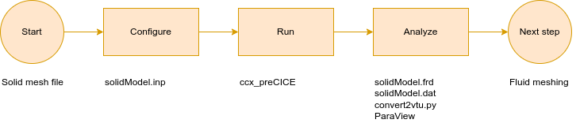

# Task 2: Simulation of the Solid domain

In this section we'll simulate the Solid domain alone, to gain confidence with the CalculiX syntax and to check that our solid mesh and model work. CalculiX allows us to perform different kinds of simulations (e.g., static, dynamic, frequency...). The coupled simulation we want to end up with will be a dynamic one, so we already start with setting up a dynamic singe-physics simulation.

This model represents a cantilevered wing subject to its own weight. The load is applied progressively, with a ramp law. Several simplifications are made here in the sake of time restrictions.

General overview of this task:



## Complete the dynamicModel.inp file

In the `skeleton` folder:

- Copy your generated solid mesh in the current folder

Open the `dynamicModel.inp` file and:

- Replace `YOURMESH.inp` (line 4) with the name of the mesh (we previously named this `wing2312_m.inp`)
  - Note that CalculiX expects distance units in meters, while FreeCAD generates meshes with distances in millimeters. We need to adapt the values (see the end of the solid meshing task).
- Replace the material properties with the following, roughly corresponding to a Polyurethane elastomer (TPU):
  - `E: 1.0E9` (Young modulus: $E=1 GPa$)
  - `NU: 0.35` (Poisson ratio: $\nu = 0.3$)
  - `RHO: 1060` (density: $\rho = 3000 \frac{kg}{m^3}$)
- replace the numerical properties `DAMP`, `DT`, `TFINAL` with:
  - `DAMP: 0.0025` (structural damping, see notes below)
  - `DT: 5.0E-2` ($\Delta  t = 5 \cdot 10^{-2}s$)
  - `TFINAL: 4.0` ($t_{final} = 4 s$)
- replace `NODESET` with the name of the set of root nodes (`Nroot_Nodes`)
- replace `RAMPSEQUENCE` with the sequence `0.0, 0.05, 0.5, 1.0, 4.0, 1.0`. This is a sequence of value pairs `{time, amplitude}` as in the following picture:  


Notice the structure of the file:

- Input a geometry file
- Define the material properties
- *CalculiX* allows you to add **Rayleigh damping** to dynamic simulation, using the keyword `DAMPING`, which takes 2 arguments: `ALPHA` and `BETA`. They define the damping matrix as $C = \alpha \cdot M + \beta \cdot K$
- Define a computation step
- Define a dynamic simulation
  - `DIRECT` specifies that the user-defined initial time increment should not be changed
  - `ALPHA` takes an argument in the range $\left[-\frac{1}{3}, 0 \right]$. It controls the dissipation of the high frequency response: lower numbers lead to increased numerical damping
- Define constraints: Here, we define a constraint in which the nodes belonging to the set are fixed. Numbers `1, 3` indicate that node coordinates from `1` ($x$ direction) to `3` ($z$ direction) are fixed.
- Define loads. We define here a distributed load (body force) `GRAV` $\vec{g} = 9.81$ with direction $(0, -1, 0)$, applied gradually over time.
- Define the simulation output:
  - `U`: displacements
  - `S`: stresses
  - `E`: strains
  - `RF`: resultants (i.e., combination) of the reaction forces on the root nodes. These are additionally computed values that will be printed to a log file.

## Run the simulation

In order to run the simulation, open a terminal in the current folder and type:

```shell
ccx_preCICE -i dynamicModel
```

Notes:

- Remember to type the input file without the extension
- If you need to clean your simulation, you can use `clean.sh`
- Even though we are using the executable `ccx_preCICE` (modified CalculiX which includes calls to preCICE), we have not defined any coupling interface yet. This is only a single-physics simulation for now.

## Analyze the results

The main result files are:

- `dynamicModel.frd`: CalculiX result format, which contains all the `U`, `S` and `E` information.
- `dynamicModel.dat`: log file containing the reaction forces.

We can convert `frd` files to other formats supported by ParaView using various converters. Look for the `convert2vtu.py` file in the current folder and type:

```shell
python3 convert2vtu.py
```

This script calls [ccx2paraview](https://github.com/calculix/ccx2paraview) with the appropriate settings and generates one `vtu` file per time step and a `pvd` file pointing to these.

Alternatively, we could directly open `.frd` in FreeCAD, in the CalculiX tool CGX, or in other tools. However, we will later want to open the results of both the Solid and Fluid participants in the same tool, and ParaView fits this purpose.

### Deformation of the wing

Open the `dynamicModel.pvd` file in ParaView. You can then look at the deformed shape of the wing by applying a `WarpByVector` filter based on the `U` vector (and a small scale factor):


### Reaction forces

Open `dynamicModel.dat` with a text editor. This file contains a vector for each time step of the simulation. If you go towards the end, you'll notice that the `y` component of the reaction force converges (in magnitude, opposite in sign) to the weight of the wing.

### Theoretical data of the wing

The good thing with using standard geometry designs (in this case, NACA airfoils), is that we get data to compare our simulation results to, or we can easily compute derived quantities. For this NACA2312 and these material parameters:

- Area section of the wing: $A=8.0958 \cdot 10^{-4}m^2$
- Inertia moment $J_x = 6.9464 \cdot 10^{-9}m^4$
- Length of the wing: $l=0.3m$
- Total weight of the wing is $\rho \cdot g \cdot A \cdot l = 2.526 kg$
- Distributed load along the span (beam approximation, see picture below) $w=\rho \cdot g \cdot A$
- Expected tip displacement: $y_B = -\frac{w l^4}{8EJ_x} = -1.227 \cdot 10^{-3}m$


Note that we are a bit lazy here, as the $x, y$ axes are not *principal axes*. Nevertheless, we are very close and the approximation holds.

## References

- CalculiX user manual: https://www.dhondt.de/ccx_2.20.pdf
- Web version (possibly outdated): https://web.mit.edu/calculix_v2.7/CalculiX/ccx_2.7/doc/ccx/ccx.html
