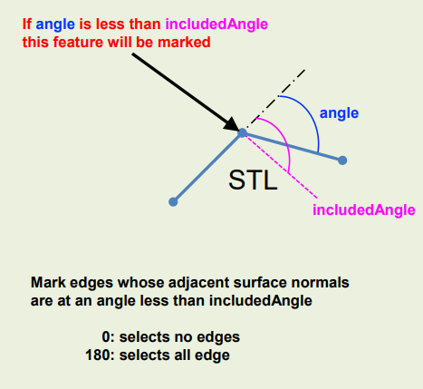

## Edge refinement

Before running - `snappyHexMesh` you can perform an explicit edge refinement based on the angles between surfaces in the STL file. The specific dictionary is:

- `surfaceFeatureExtractDict`

### surfaceFeatureExtractDict

The utility `surfaceFeatureExtract` can extract sharp edges from .STL surfaces. It reads settings from its dictionary file `surfaceFeatureExtractDict` located in `system` subdirectory.

**Open** `surfaceFeatureExtractDict` and change *yourSTLfile.stl* with the actual name of the wing (i.e. **naca2312.stl**).

You will also notice the key parameter of this dictionary: `includedAngle`. The following images show how it works:

In this case we keep **0** as parameter, so that no edges are selected.

The last parameter `writeOhbj` allows you to write *Paraview readable* files (with `.obj` extension) so that you can see which edges are selected.

Now you can run `surfaceFeatureExtract` from the root directory of the case. After execution you'll find:

- `naca2312.eMesh`  in the `constant/triSurface` folder (this will be referred to in `snappyHexMeshDict`)
- `ExtendedFeatureEdgeMesh` folder in `constant`, containing the `.obj` files (if selected).

### Update snappyHexMeshDict

In the **features** entry (from line 100):

- uncomment lines **102 to 105**: `naca2312.eMesh` is the output of the `surfaceFeatureExtract` task
