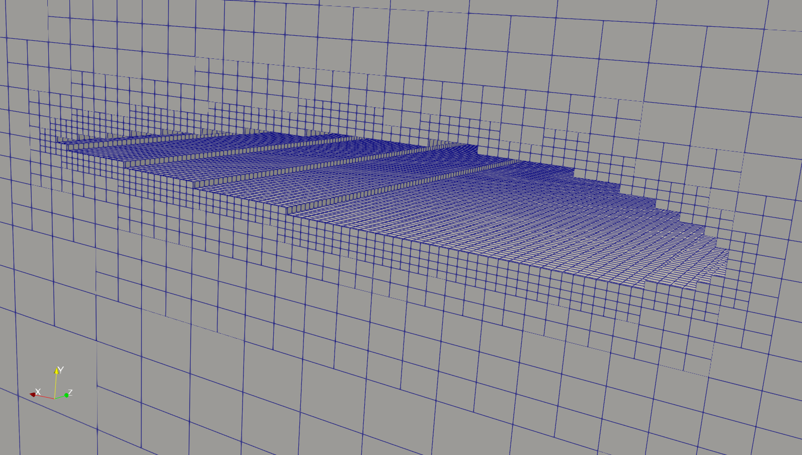
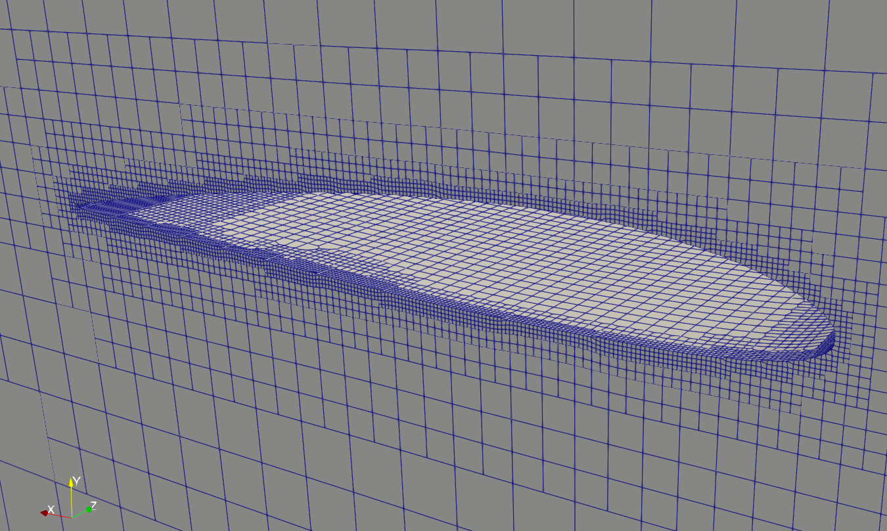

# Step 3: Mesh of Fluid domain

In this section we'll generate the Fluid Mesh using using the utility `snappyHexMesh` in OpenFOAM v2406.
The objective is to mesh a rectangular shaped region  surrounding an object described by an *STL surface*, as commonly done in external aerodynamics simulations.

## Introduction

The mesh generation process in OpenFOAM consists of several steps. You'll find the required files in the `skeleton` directory, which is more or less structured as a common OpenFOAM case, with the `constant` and `system` folders.
There is no `0` folder as it is not required at this step.

You'll also find two Bash scripts:

- `clean_mesh.sh`: this script allows you to remove all the intermediate and solution files, in case you want to start over with a new computation
- `run_mesh.sh`: this script runs all the required steps in a batch. **Do not use this yet**, as we first need to prepare the respective configuration files.

In order to generate a mesh, you need the following:

- a background hexaedral mesh which defines the extent of the computational domain and a base level mesh density. generated using `blockMesh`
- surface data files in *STL format*, either binary or ASCII
- a `snappyHexMeshDict` dictionary, with appropriate entries, located in the `system` sub-directory of the case

## Configuring blockMesh

The first task consists in generating the fluid domain. This is achieved by the tool `blockMesh`, which creates the domain and the external boundaries based on the parameters contained in the dictionary `blockMeshDict` in the `system` folder.

### Domain dimension

In this case we create a box:

- 1.5m long in *x* direction (the direction of the freestream)
- with a section of $0.48 \times 0.48$ m in *y* (*lift* direction) and *z* (*span* direction)

If you look at the reference frame of the wing in the `blockMeshDict`, you'll notice that it is placed at the root section at mid chord. So:

- we place the *inlet* face at $x_1 = -0.24$m and the *outlet* face at $x_2 = 1.2536$ m.
- we place the wing in the middle of the box in *y* direction, so we place the *y* limits at $y_1 = -0.24$ m and $y_2=0.24$ m.
- finally, we place the root section at $z_1 = 0$ m and the final face at $z_2 = 0.48$ m.

All these parameters are set at lines `24-29` of `blockMeshDict`. For the moment, leave them like this.

### Discretization

Once we have defined the limits, we need to define the number of blocks that we want in each direction. Look for the dictionary entry `blocks` in `blockMeshDict` and locate the terms `NX`, `NY` and `NZ`. These represent the number of cells in which the domain will be divided into in each direction.
We divide the domain into $0.08 \times 0.06 \times 0.06$m cells, so you need to substitute `NX`, `NY` and `NZ` with `20`, `8` and `8` respectively.
The background mesh is quite coarse but for the moment we favor execution speed.

### Boundary conditions

`blockMeshDict` allows you to define the boundary conditions of the domain. The dictionary entry `boundary` defines:

- `inlet`: where we define the fluid velocity of the incoming flow
- `outlet`: where we define the properties of the outgoing flow to be at constant pressure
- `slip`: far away faces can be considered as *frictionless walls*
- `symmetryPlane`: the face containing the root of the wing is considered a symmetry plane

## Generating the background mesh

After you have sourced your OpenFOAM, you can run `blockMesh` from the root folder of the case to generate the external domain.

If you want to look at the domain, you can run `paraFoam -block`

(**TODO**: image)

## Configuring snappyHexMesh

Once we have generated the background mesh, we need to refine it and subtract the wing. The geometry of the wing must be a surface data file in *STL format*, either binary or ASCII, located in the `constant/triSurface` sub-directory of the case directory.

Your first task is to copy `naca2312.stl` in the `constant/trisurface` directory.

Then you'll need to work on the following dictionary files:

- `snappyHexMeshDict`
- `decomposeParDict`

### snappyHexMeshDict

The mesh generation process in `snappyHexMesh` is composed of 3 stages:

- `castellatedMesh` which performs cells splitting and removal 	
- `snap` which performs cell vertex points motion onto surface geometry 
- `addlayers`: which introduces additional layers of hexahedral cells aligned to the boundary surface

Each of them can be activated in the `snappyHexMeshDict` (lines *23-25*).

There are a lot of parameters in the `snappyHexMeshDict` dictionary, we invite you to look at the comments in the file, at the references below and at the documentation for further details.
Here we focus on a few of them:

#### Geometry (from line 33)

The geometry of the main elements of the mesh can be specified through an STL surface or geometry entities. Here we define our wing and two refinement regions:

- substitute `yourSTLfile.stl` with `naca2312.stl`
- notice that two refinement regions are defined:
    - `refineBox` around the wing
    - `wake` behind the wing

#### Castellation (from line 58)

In the **refinementSurfaces** entry (from line 113):

- substitute `DEFINETYPE` with `wall` under `naca2312/patchInfo`: we are telling *snappy* that our *STL* file is a boundary.

Notice the **locationInMesh** entry (line 167):

- Point vector inside the region to be meshed. This must be outside the wing and inside the initial mesh.

#### snapControls (feom line 177)

For the training we don't touch the parameters in this section.

#### Add Layers (from line 217)

This section allows to define the boundary layer properties around our wing.

In the **layers** entry (from line 223)

- substitute `yourSurface` with `naca2312` (i.e. the name assigned to your STL file on line 38)
- substitute the value `NL`  with `3` at the `nSurfaceLayers` entry

That is: we want to add **3 layers** to the **naca2312** surface.

At the `expansionRatio` entry (line 242) substitute `ER` with `1.0`: we want the 3 layers to be of the same height.

Now your `snappyHexMeshDict` is complete. As we want to perfomr this operation in parallel, we first need to decompose the domain.

### decomposeParDict

Open the `decomposeParDict` file in the `system` directory:

- substitute `ND` on line 11 with **8**: this is the number of subdomains in which your case will be decomposed.

## Meshing

Now everything is ready to mesh our domain.

### decomposePar

First run `decomposePar`: your case will be divided into **8** subdomains (notice the directories `processorX` in the root folder of your case).

### snappyHexMesh

Now you can run: `mpirun -np 8 snappyHexMesh -parallel`

### reconstructParMesh

Once `snappyHexMesh` has finished, you can reconstruct your domain from the decomposed ones by running `reconstructParMesh`.

When finished, you will see **3** time folders (0.001, 0.002, 0.003) in the root directory of the case. Each one corresponds to a stage of `snappyHexMesh`:

- 0.001: castellatedMesh

- 0.002: snap

- 0.003: addLayers

Notes:
- the timestep depends on the `deltaT` parameter in the `controlDict` file, but it is not relevant
- you can obtain the final mesh in the `constant` directory, without the intermediate steps, by adding the `-overwrite` option to `snappyHexMesh`

## checkMesh

Finally, you can have an idea of the quality of the mesh, in particular if there are distorted cells, by typing:

 `checkMesh -latestTime |  tee log.checkMesh`

## References

Most of the info are taken from: http://www.wolfdynamics.com/wiki/meshing_OF_SHM.pdf

You can also consult the official documentation: https://www.openfoam.com/documentation/user-guide/4-mesh-generation-and-conversion/4.4-mesh-generation-with-the-snappyhexmesh-utility