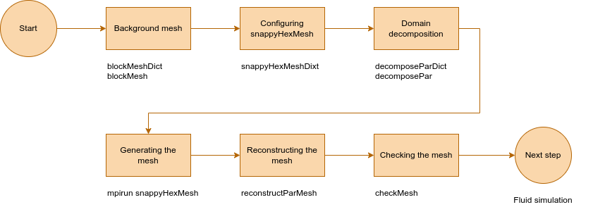
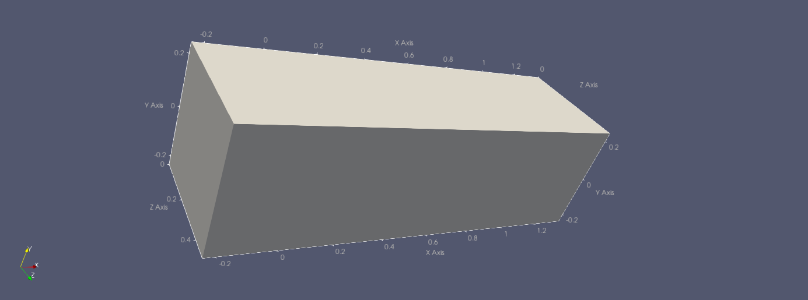

# Task 3: Mesh of the Fluid domain

In this section we'll generate the Fluid Mesh for OpenFOAM.
As we are doing external aerodynamics, we will first generate a background mesh and then embed the geometry in that mesh, removing the respective region.
We will generate the mesh directly with the OpenFOAM tools blockMesh and snappyHexMesh.

See a general overview of this task in Figure @fig:t3-overview.

{#fig:t3-overview}

In `skeleton/`, you can find:

- The `constant` and `system` directories expected in an OpenFOAM case
- `clean_mesh.sh`: Removes all the intermediate and solution files
- `run_mesh.sh`: Runs all the required steps in a batch

In order to generate a mesh, we need the following:

- A background hexahedral mesh which defines the extent of the computational domain and a base level mesh density. Generated using `blockMesh`
- An STL file with the respective object geometry
- A `snappyHexMeshDict` dictionary

## Background mesh

To generate the background mesh, we need to configure the `system/blockMeshDict` file. Inspect this file and follow the comments (everything is pre-filled).

### Domain dimensions

We create a bounding box with dimensions:

- $1.6m$ long in $x$ direction (the direction of the freestream)
- with a section of $0.48 \times 0.48$ m in $y$ (*lift* direction) and $z$ (*span* direction)

The reference frame of the wing assumes point (0,0,0) to be in the middle of the chord:

- We place the `inlet` face at $x_1 = -0.24$m and the `outlet` face at $x_2 = 1.36$ m.
- We place the wing in the middle of the box in $y$ direction, so we place the $y$ limits at $y_1 = -0.24$ m and $y_2=0.24$ m.
- Finally, we place the root section at $z_1 = 0$ m and the final face at $z_2 = 0.48$ m.

All these parameters are set in the beginning of `blockMeshDict`. For the moment, leave them like this.

### Mesh resolution

Once we have defined the limits, we need to define the number of cells that we want in each direction. Look for the dictionary entry `blocks` in `blockMeshDict`, which defines a block of a 20 x 8 x 8 cells per $x,y,z$.
This means that we divide the domain into cells of $0.08 \times 0.06 \times 0.06$m.
Since time in this course is short, let's stick with such a coarse background mesh.

### Boundaries

The dictionary entry `boundary` defines the following boundary patches of the domain:

- `inlet`
- `outlet`
- `slip`: far away faces (considered as frictionless walls)
- `symmetryPlane`: the root of the wing

While we specify some patches here as `slip` or `symmetryPlane`, we will define the concrete boundary conditions in the next task.

### Generating the background mesh

In the `Fluid` folder, run:

```shell
blockMesh
```

If you only want to look at the topology of the domain, without yet meshing it, you can run `blockMesh -write-vtk`. You can then visualize the `blockTopology.vtu` file in ParaView (Figure @fig:t3-topology). You can enable the `Axis Grid` in the Properties tab.

{#fig:t3-topology}

## Configuring snappyHexMesh

Once we have generated the background mesh, we need to refine it and subtract the wing. The geometry of the wing must be a surface data file in STL format, either binary or ASCII, located in the `constant/triSurface` subdirectory of the case directory. Copy the `naca2312.stl` there.

The mesh generation process in `snappyHexMesh` comprises three stages:

- `castellatedMesh`: performs cell splitting and removal
- `snap`: performs cell vertex points motion onto surface geometry
- `addlayers`: introduces additional layers of hexahedral cells aligned to the boundary surface

Each stage can be activated in the beginning of the `system/snappyHexMeshDict` file. Activate all of them.

There are a lot of parameters in the `snappyHexMeshDict` dictionary; we invite you to look at the comments in the file, at the references below, and at the documentation for further details. Let's focus on the most relevant for this exercise.

### Geometry

This is defined in the `geometry` subdictionary.

The geometry of the main elements of the mesh can be specified through an STL surface or geometry entities. Here we define our wing and two refinement regions:

- substitute `yourSTLfile.stl` with `naca2312.stl`
- notice that two refinement regions are defined:
  - `refineBox` around the wing
  - `wake` behind the wing

### Castellation

The castellation stage removes the cells inside (or outside) the specified geometry, resulting into a castellated (staircase-shaped) mesh.
This is defined in the `castellatedMeshControls` subdictionary.

In the `refinementSurfaces` entry, substitute `DEFINETYPE` with `wall` under `naca2312/patchInfo`: We are telling snappy that our STL file is a boundary.

Notice the `locationInMesh` entry: This is an arbitrary point outside the wing and inside the initial mesh (any location in this region will do).

### Adding layers

Close to the boundaries, it is good practice to have additional layers of refinement. We define this in the `addLayersControls` subdictionary:

- under `layers`, substitute `yourSurface` with `naca2312` (i.e., the name assigned to your STL file in the `geometry` subdictionary)
- under `layers`, substitute the value `NL`  with `3` at the `nSurfaceLayers` entry
- under `expansionRatio`, substitute `ER` with `1.0`: we want the layers to be of the same height.

Now your `snappyHexMeshDict` is complete. As we want to perform this expensive operation in parallel, we also need to define how to decompose the domain.

## Domain decomposition

Open the `decomposeParDict` file in the `system` directory and substitute `ND` with `8` in `numberOfSubdomains`: this is the number of subdomains in which your case will be decomposed, and it should typically not exceed the number of cores of the system. This number needs to agree with the number of subdomains per direction, defined in `hierarchicalCoeffs` (in this case, 4x1x2).

Decompose the domain by running (in `Fluid/`):

```shell
decomposePar
```

Eight directories with names `processor[0-7]` will be generated, including configuration files similar to the ones defined for a single-process case.

## Generating the mesh

Now we can create the mesh for the eight subdomains in parallel:

```shell
mpirun -np 8 snappyHexMesh -parallel
```

This will take a few minutes to complete.

In case you get an error that there are not enough slots in your system to run eight processes, reduce the `numberOfSubdomains` in `decomposeParDict` (adjusting the subdomains per direction) and the number of processes in `mpirun` accordingly. If you still want to execute eight processes, you can pass the `--oversubscribe` option to `mpirun`. This is then expected to take significantly longer.

### Reconstructing the mesh

Once `snappyHexMesh` has finished, you can reconstruct your domain from the decomposed ones by running `reconstructParMesh`.

When finished, you will see three time folders (0.001, 0.002, 0.003) in the root directory of the case. Each one corresponds to a stage of `snappyHexMesh` (Figures @fig:t3-stage-1, @fig:t3-stage-2, @fig:t3-stage-3). The time step size depends on the `deltaT` parameter in the `controlDict` file, but it is not relevant. You can obtain the final mesh in the `constant` directory, without the intermediate steps, by adding the `-overwrite` option to `snappyHexMesh`. In the next step (fluid simulation), we will use and rename the `0.003` directory.

{#fig:t3-stage-1}

{#fig:t3-stage-2}

{#fig:t3-stage-3}

## Checking the mesh

`checkMesh` can give us some mesh quality metrics (in particular, whether there are any distorted cells):

```shell
checkMesh -latestTime
```

If everything goes well, you should see a `Mesh OK.` at the end.

## References

Most of the information is taken from [this training presentation of Wolf Dynamics](http://www.wolfdynamics.com/wiki/meshing_OF_SHM.pdf) (with permission).

You can also consult the [official documentation](https://www.openfoam.com/documentation/user-guide/4-mesh-generation-and-conversion/4.4-mesh-generation-with-the-snappyhexmesh-utility)
