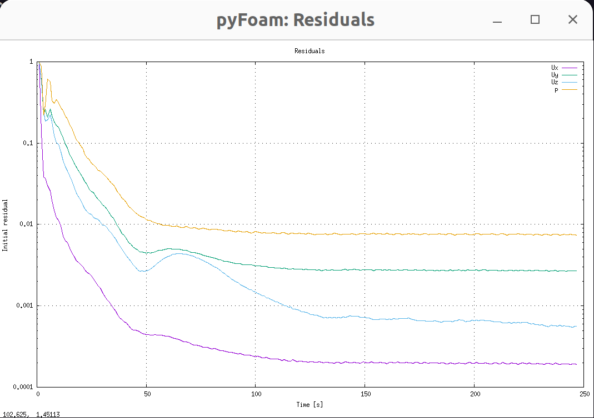

# Task 4: Simulation of the Fluid domain

In this section we'll use the previously generated Fluid Mesh to perform a single physics flow simulation. Besides checking the validity of the model, this allows us to obtain an initialized fluid domain for the FSI simulation.

We start here from a steady-state simulation. Later, in the FSI part, we will switch to a transient simulation.

In the following, we will simulate a scenario with incompressible, laminar flow of water with:

- $U_{\infty} = 0.5 \ \mathrm{m/s}$
- $\rho = 1000 \ \mathrm{kg/m^3}$
- $\nu = 1 \cdot 10^{-6} \ \mathrm{m^2/s}$
- $Re = \frac{U_{\infty} c}{\nu} = 5 \cdot 10^4$

The solution also includes a scenario with air.

## Configuration

### Boundary and initial conditions

Th new folder `0.orig/` contains the boundary and the initial conditions for each of the simulation variables: files `U` and `p`.

Open the file `U` and:

- Substitute `UINF` in the `internalField` dictionary entry with the value `0.5`. This initializes the whole domain to $U_{\infty}$
- Substitute the boundary condition `BOUNDARY` for the `naca2312` patch in the `boundaryField` entry with `noSlip`.

Note: we use the folder `0.orig` instead of the usual folder `0` just in case the simulation overwrites the initial conditions (e.g., you execute `potentialFoam` to initialize the fluid domain). The run script copies `0.orig` to `0`.

### Mesh and model properties

In the `constant/` directory:

- Copy here the `polyMesh` folder, from the `0.003` folder or the previous task.
- In the `transportProperties` file, replace the `NU` (kinematic viscosity) with `1e-06`.
- In the `turbulenceProperties`, we already define a `laminar` simulation.

### Numerics

In the `system/` directory, we define numerical properties and other options regarding the simulation execution. The files one typically needs to configure are `controlDict`, `fvSchemes`, and `fvSolution`.

- Have a look into the `controlDict` file and:
    1. substitute `END` with `250` at `entTime` entry: we will perform 250 steady-state iterations at most.
    2. substitute `RHO` with `1000.0` in the `forces_object` and in the `forceCoeffs_object`. These function objects compute some forces we will later analyze. We have already pre-filled further parameters (`magUInf`, `lRef`, `Aref`).
    3. Notice that we define `simpleFoam` as `application`. This is a steady-state solver implementing the [SIMPLE algorithm](https://en.wikipedia.org/wiki/SIMPLE_algorithm).

- Open `fvSchemes` and substitute `SIMULATIONTYPE` with `steadyState`.

- Open `fvSolution` and in the `residualControl` entry set the thresholds for earlier exiting the steady-state simulation:
    1. substitute `P_RES` with `1e-4`
    2. substitute `U_RES` with `1e-4`

## Running the case

In order to run simulation, open a terminal from the `skeleton` folder and type:

```shell
./run_case.sh`
```

This script:

- Copies `0.orig` into `0`
- Decomposes the case
- Runs `simpleFoam` in parallel and logs the output in `log.solver`
- Reconstructs the latest time step

By default, the script runs the case with 8 processes, using over-subscription. You can change the partitioning by changing the `system/decomposeParDict` and you then change the number of processes in `run_case.sh`.

The simulation will probably take around 5 min to complete all 250 iterations. We still get a pretty much converged state, even if the residuals in this case don't reach the limits which would automatically stop the simulation.

Use the script `clear_case.sh` in case you need to start from scratch.

### Monitoring

To check the simulation progress and plot the residuals over time, you can use [PyFoam](https://pypi.org/project/PyFoam/):

```shell
pyFoamPlotWatcher log.solver
```

Two pop-up windows with residual graphs should appear:



## Analyzing the results

In order to understand if your simulation has converged and if you have obtained reasonable results, you can look at the output of the `functions` that we enabled in the `controlDict` dictionary. You can plot force coefficients over time with:

```shell
python3 plotCoefficients.py
```

A pop-up window should appear:


You could compare these values with theoretical data (not available), or you could perform some mesh-convergence study to check the convergence of your setup.

### Reconstructing the case

Your case is decomposed into 8 subdomains. You can still view the results in ParaView by selecting `Decomposed Case` once you opened `Fluid.foam` (see picture below).


In our case, we only need the latest time step (`250`), which will be the initial state of our coupled simulation. We can reconstruct the decomposed case for this time step:

```shell
reconstructPar -latesttime
```

There should now be a `250/` directory containing the files `U`, `p`, and `phi`. Move these files into `results/water/`, overwriting the currently empty files. We will use these results as initial state for the FSI simulation.

## Alternative setup: air (optional)

Now we consider a laminar incompressible simulation in air, with the same Reynolds number. The main parameters are:

- $U_{\infty} = 7.5\ \mathrm{m/s}$
- $\rho = 1.225 \ \mathrm{kg/m^3}$
- $\nu = 1.5 \cdot 10^{-5}\ \mathrm{m^2/s}$
- $Re = \frac{U_{\infty} c}{\nu} = 5 \cdot 10^4$

For this:

- Use `clean_case.sh` in the root folder. It removes the following:
  - `0` folder
  - `processor*` folder
  - `postProcessing` folder
- Remove the `250` directory
- Update the simulation values
- Rerun the simulation
- Reconstruct the case and move the `250` directory in the `results/air/250` folder
