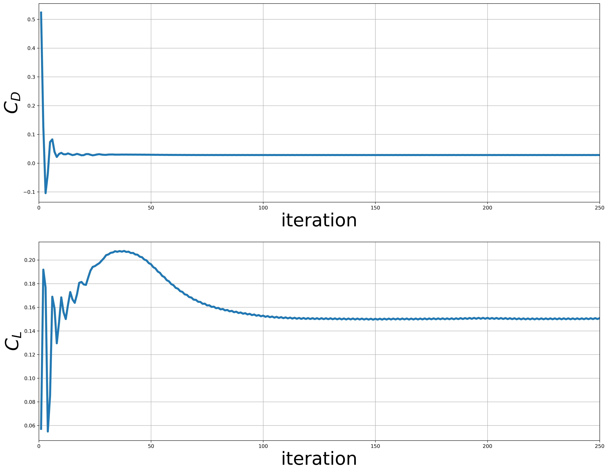
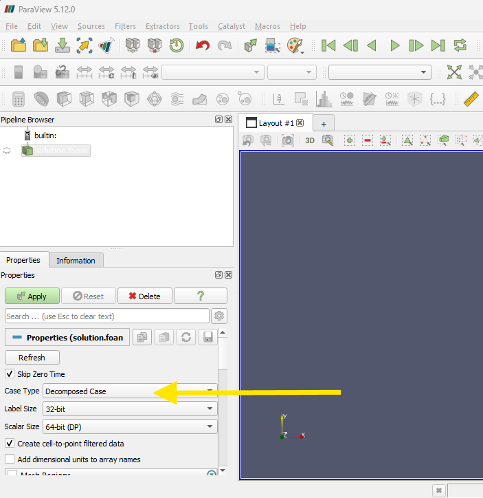

# Step 4: simulation of the Fluid domain

In this section we'll use the previously generated Fluid Mesh to perform a single physics simulation.
This will allow us to perform two important tasks:

- check the validity of our model
- obtain an initialized fluid domain, to be used in the FSI simulation

## Introduction

We want an initialized fluid domain, so we can simply perform a **steady state** simulation. Later, in the FSI part, we will switch to a transient simulation.

You'll find the required files in the `skeleton` directory. The `Fluid` directory is the OpenFOAM root case, containing the `constant`, `system` and
`0.orig` folders. We put everything into the `Fluid` directory to familiarize with the fact that we'll soon have a `Fluid` and a `Solid` case.

**TODO** decide how to proceed:

- one case:
    1. $Re=5\cdot 10^4$ laminar, incompressible, water
    2. $Re=5\cdot 10^4$ laminar, incompressible, air
- two cases:
    1. case **1** and **2** above
 
## Setup *Simulation 1*

Here we consider a laminar incompressible simulation in water. The main parameters are:

- $U_{\infty} = 0.5 \ \mathrm{m/s}$
- $\rho = 1000 \ \mathrm{kg/m^3}$
- $\nu = 1 \cdot 10^{-6} \ \mathrm{m^2/s}$
- $Re = \frac{U_{\infty} c}{\nu} = 5 \cdot 10^4$

### `0.orig` folder

This folder contains the boundary and the initial conditions for each of the simulation variables: files `U` and `p`.

Open the file `U` and:

- substitute **UINF** in the `internalField` dictionary entry with the value **0.5**. This initializes the whole domain to $U_{\infty}$
- substitute the boundary condition **BOUNDARY** for the *naca2312* patch in the `boundaryField` entry with **noSlip**

Note: we use the folder `0.orig` instead of the usual folder `0` just in case the simulation overwrites the initial conditions (e.g., you execute `potentialFoam` to initialize the fluid domain). The launch script that we prepared will take care of copying `0.orig` to `0`.

### `constant` folder

Here you need to perform the following activities:

- Use the **mesh** you generated in the previous task: copy the `polyMesh` folder, which you can find in the `0.003` folder, in here
- Open the `transportProperties` file to define the kinematic viscosity $\nu$: substitute **NU** with `1e-06`
- Open the `turbulenceProperties` file to define the type of simulation: substitute `TYPE` with `laminar`, to perform a **laminar** simulation

### `system` folder

Here you will define how many simulation steps you want to perform and you will make use of *function objects* in order to compute **forces, moments** and **force** and **moment coefficients**:

- Open the `controlDict` file and orientate yourself on the different sections. Then:
    1. substitute **END** with **250** at `entTime` entry: we will perform 250 simulation steps at most
    2. substitute **RHO** with **1000.0** in the `forces_object` and in the `forceCoeffs_object`
    3. again in the in the `forceCoeffs_object`:
       1. substitute `UINF` with `0.5`
       2. substitute `CHORD` with `0.1`
       3. substitute `AREA` with `0.03`

Then you will define the type of the simulation and some thresholds for the residuals so that, if we reach those values, the simulation stops before *endTime*:

- Open `fvSchemes` and substitute `SIMULATIONTYPE` with `steadyState` in the `ddtSchemes` dictionary entry
- Open `fvSolution` and in the `residualControl` entry:
    1. substitute `P_RES` with `1e-4`
    2. substitute `U_RES` with `1e-4`

## Run the case

In order to run simulation, open a terminal from the `skeleton` folder, source OpenFOAM (e.g. type `of2406`) and then type `./run_case.sh`. This script will take care of:

- copying `0.orig` into `0`
- decomposing the case
- running `simpleFoam` in parallel and logging the output in `log.solver`
- reconstucting the latest timeStep

By default, the script is running the case with 8 processes, using oversubscription. You can change the partitioning by changing the `system/decomposeParDict` and you then change the number of processes in `run_case.sh`.

The simulation will probably take around 5 min to complete all 250 iterations. You can get a pretty much converged state, even if the residuals in this case don't reach the limits which would automatically stop the simulation.

## Monitoring

To check the simulation progress and plot the residuals over time, you can:

- open another terminal
- go to the `Fluid` folder
- source OpenFOAM
- type `pyFoamPlotWatcher log.solver` (requires [PyFoam](https://pypi.org/project/PyFoam/))

## Analyzing the results

In order to understand if your simulation has converged and if you have obtained reasonable results, you can look at the output of the `functions` that we enabled in the `controlDict` dictionary.

You can plot force coefficients over time by typing in the case root folder:

`python3 plotCoefficients.py`

You should see something like:

You can compare those values with theoretical data (if you have them), or you can perform some *mesh independence study* to check the convergence of your setup. But for the sake of time, let's move on to the FSI part.

### Reconstruct the case

Your case is decomposed in 8 subdomains. You can still view the results in **Paraview** by selecting `Decomposed Case` once you opened `Fluid.foam` (see picture below).

In our case we only need the latest time-step (`250`), which will be the initial state of our coupled simulation. In your terminal type

`reconstructPar -latesttime`

You will see the `250` folder in the root folder of your case containing the files `U`, `p`, and `phi`. Move those files in the `results/water` folder (overwrite the empty files), we will use it in the FSI simulation.

## Setup *Simulation 2* (optional)

Now we consider a laminar incompressible simulation in air, with the same Reynolds number. The main parameters are:

- $U_{\infty} = 7.5\ \mathrm{m/s}$
- $\rho = 1.225 \ \mathrm{kg/m^3}$
- $\nu = 1.5 \cdot 10^{-5}\ \mathrm{m^2/s}$
- $Re = \frac{U_{\infty} c}{\nu} = 5 \cdot 10^4$

You have to:

- use `clean_case.sh` in the root folder. It removes the following:
  - `0` folder
  - `processor*` folder
  - `postProcessing` folder
- remove the `250` directory
- update the simulation values (follow the previous steps and update the files as needed)
- rerun the simulation with the updated values
- move the `250` directory in the `results/air` folder
