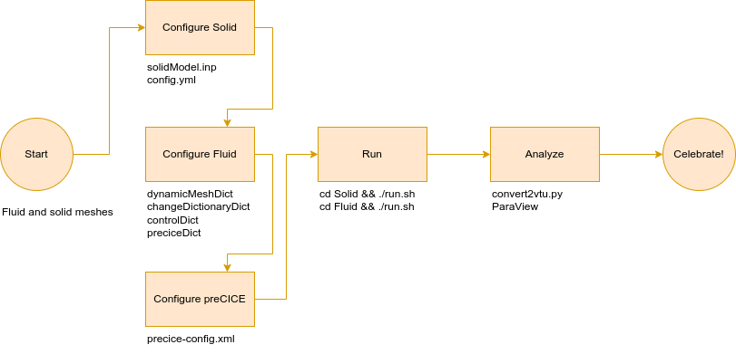
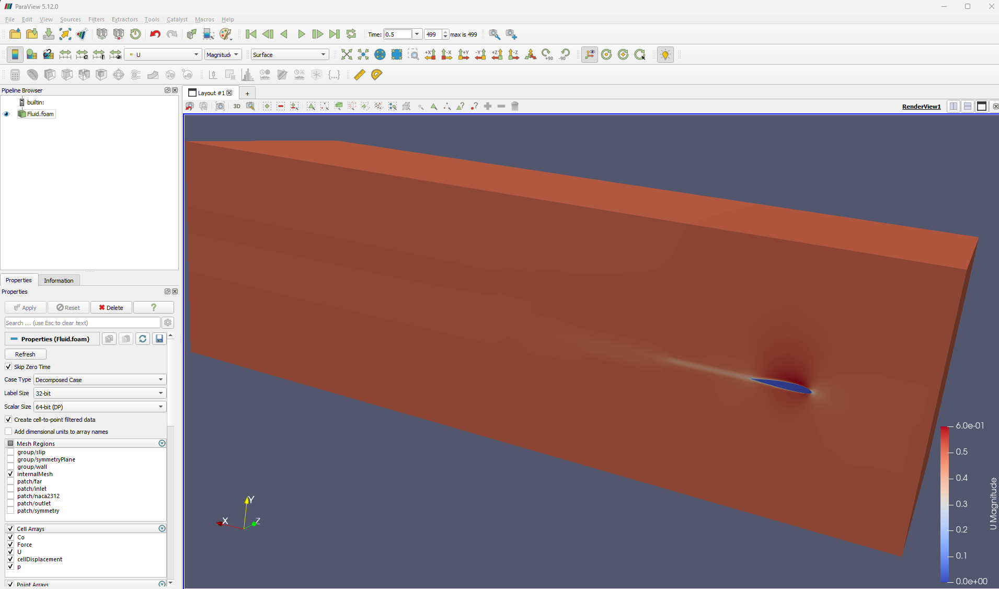
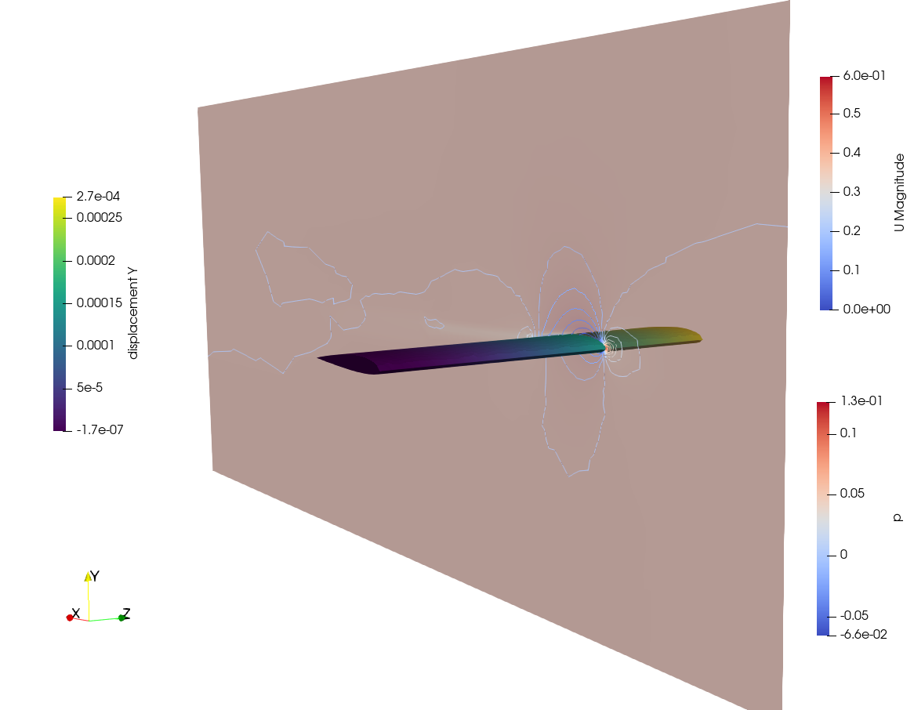

# Task 5: FSI simulation

Finally, we are now able to put everything together and start our fluid-structure interaction simulation. We'll use all the work done until now to configure the Fluid and Solid participants. The starting point of our case is in the `skeleton` folder, which is the root of our FSI case. This includes each participant to a separate directory, and the `precice-config.xml` file in their common parent directory.

General overview:



## Solid configuration

Copy the `wing2312_m.inp` mesh from `01_solidMesh` into the `Solid` directory Remember to use the one converted to *meters*. Then, we can adjust the model and configure the CalculiX-preCICE adapter.

### CalculiX configuration

Check the following changes in `solidModel.inp`:

- Section `*DYNAMIC`: we perform a simulation $0.2$ seconds long with a time-step of $1ms$
- Section `*AMPLITUDE`: we ramp the loading of the wing, starting with the $5\%$ of the total load, arriving at $100\%$ after $0.1s$
- There is no section `*DLOAD` anymore, but there is now a `*CLOAD` section.

Complete the file with the following information:

- section `*CLOAD`: replace each of the `WETSURF` entries with the name of the group given to the **wet surface** (`NwetSurface_Nodes`)

### CalculiX adapter configuration

The file `config.yml` is specific to the [CalculiX adapter](https://precice.org/adapter-calculix-config.html). The information here must match the information in `precice-config.xml`.

The entries of this file specify the path to the preCICE configuration file, the coupling mesh (`Solid-Mesh`, a nodes-based mesh defined in the preCICE configuration file), the read data (forces), and the write data (absolute displacements). In this file:

- Replace `WETSURF` with the name of the group given to the *wet surface* (see the mesh `.inp` file), **WITHOUT the `N` at the beginning** (i.e., `wetSurface_Nodes`).

The Solid participant is now ready, and we can move to the Fluid participant.

## Fluid configuration

For the Fluid participant, we will use the [OpenFOAM-preCICE adapter](https://precice.org/adapter-openfoam-config.html).

Copy the previously generated mesh: copy the `polyMesh` folder from your `0.003` folder in `03_fluidMesh/skeleton`, or from the `constant` folder in `04_fluidSimulation/skeleton/Fluid`. We can then adjust the setting that are specific the coupling.

### Mesh motion

We are using the ALE approach to FSI. This means that OpenFOAM applies a displacement vector (mesh motion) on the otherwise static mesh (the number of cells and connection between points remains the same).

In the `constant/dynamicMeshDict`, replace `WETSURF` with the name given to the wing patch (`naca2312`, specified in `constant/polyMesh/boundary`). 

In the `0.orig/` folder, you can also find a new dictionary file `pointDisplacement`, required by the mesh motion solver.

### Initial state

In task 4, we obtained an steady-state solution, which we wanted to use as initial state here. Copy the files `U`, `p`, and `phi` from `04_fluidSimulation/skeleton/results/water/250` into the `0.orig/` directory.

### Boundary conditions

When we performed the fluid simulation, we defined the surface of the wing as `noSlip` in the `0.orig/U` file, which has also been applied to the results we just copied. In FSI simulations, we need that the velocity is overwritten by the OpenFOAM-preCICE adapter, for which we need to use the `movingWallVelocity` boundary condition. To avoid opening such a large file, we can use the utility `changeDictionary`:

- Open the file `system/changeDictionaryDict`.
- In the `boundaryField` dictionary entry, replace `PATCH` with `naca2312` and `TYPE` with `movingWallVelocity`.

We will update the `0.orig/U` file automatically before running the coupled simulation (see how in `prepare.sh`).

### Simulation control

Open the `controlDict` file and:

- Notice that, compared to the previous, steady-state flow simulation, we are now using the transient `pimpleFoam` solver.
- Replace the entry `DT` for the entry `deltaT` with `1e-3` (fixed, as `adjustTimeStep` is disabled)
- Notice how we are enabling the adapter as a function object at the end of the file.

### OpenFOAM adapter configuration

The OpenFOAM adapter configuration file is `system/preciceDict`. In this file:

- Replace the entry `PATCH` in the `Interface1` dictionary entry with the name given to the wing boundary patch (`naca2312`)
- Replace the entry `RHO` in the `FSI` dictionary entry with the water density ($\rho_{water} = 1000.0 \frac{kg}{m^3}$) We are using an incompressible solver, so the adapter needs a density value to compute the forces.

## preCICE setup

Once we have prepared the two participants, we can now also configure preCICE, i.e., the coupling itself. Here is a visual overview of the preCICE configuration:


In the `precice-config.xml` file:

- Replace `DT` in the `<time-window>` tag with `0.001`
- Replace `TFINAL` in the `<max-time>` tag with `0.2`
- Replace the two occurrences of `REL_CONV` in the `<relative-convergence-measure>` tag with `1e-3`

NOTES:

- We are considering three watch-points at the tip of the wing, so that we can look at the displacement and at the pitching angle of the final section of the wing:
  - *tip mid-chord* at coordinates `0.0; 0.0; 0.3`
  - *tip leading edge* at coordinates `-0.05; 0.0; 0.3`
  - *tip trailing edge* at coordinates `0.05; 0.0; 0.3`

- All the simulation components share the same $\Delta t$ and $t_{final}$.
- The convergence measure that we chose is a good compromise between accuracy and execution time.
- We are using the same $\Delta t$ for the Fluid and the Solid part, which is also the same as the coupling time window here. This means that the two participants are *not subcycling*.

## Running the coupled simulation

Now we are ready to perform the coupled simulation.

As expected, FSI simulations take a long time. If you are short in time, just read through the instructions and continue with analyzing the provided results in the `solution/` directory.

### Solid participant

Open a terminal and enter the `Solid` folder. Here you simply run the `run.sh` script:

```shell
./run.sh
```

This starts CalculiX as the `Solid` preCICE participant. The Solid participant should now start and wait for the Fluid participant to appear as well.

### Fluid participant

Open another terminal and enter the `Fluid` folder. Here you have to:

- Run `./prepare.sh`, which:
  - copies `0.orig` into `0`
  - uses `changeDictionary` to switch the boundary condition from `noSlip` to `movingWallVelocity`
  - decomposes the case into **8** subdomains
- Run `./run.sh` to start the parallel simulation (this will take several minutes)
- After the simulation completes, run `./post-run.sh` to remove some empty result directories, which are created for technical reasons but are making further analysis trickier.

In case the 8 subdomains are too many for your system, see the related notes in Task 4.

### Monitoring

You can monitor the ongoing simulation by running the following scripts:

- `./plotDisplacement.sh`: Plots the displacements over time (exported as watch-points).
- `python3 ./plotConvergence.py`: Plots the number of iterations and the relative error for each time step.

Two windows with the following graphs should appear. The simulation ends after 200 time steps (at t=0.2s).


### Cleaning

In case you need to remove the results and log files before starting your simulation again, use the `clean.sh` script of each participant case.

## Results

In order to open the results of both participants in the same ParaView window, we first need to convert the CalculiX results file `solidModel.frd` to a format compatible with ParaView:

```shell
python3 convert2vtu.py
```

This will create a `convert` folder where you will find one `.vtu` file for each exported time step.

In case you need to synchronize the results of the two participants, you can apply a `TemporalShiftScale` filter in one of the two data sets in ParaView. See also the [visualization documentation page](https://precice.org/tutorials-visualization.html).

### Fluid results

Open a terminal in the `Fluid` folder and type `paraFoam`

1. This will create an (empty) `Fluid.foam` in the folder, which helps ParaView identify this folder as OpenFOAM results.
2. In `Case type` select `Decomposed Case`
3. Then press `Apply`


You will then have access to the `OpenFOAM` fluid simulation results.



### Solid results

In the same ParaView window, select `File->Open...` and point to the `Solid/convert/solidModel.pvd` file.



To see the displacement more easily, you can apply a `WarpByVector` filter, using the displacement (`U`) as vector, and a scale factor of your choice.

## Alternative setup: air (optional)

In the folder:

```shell
./05_FSI/solution/FSI_air
```

you can find another case with other physical properties, both for the fluid (air) and for the solid (close to propylene). The Reynold number is still $5\cdot10^4$. We leave it to you as a starting point to change some physical properties or experiment.
